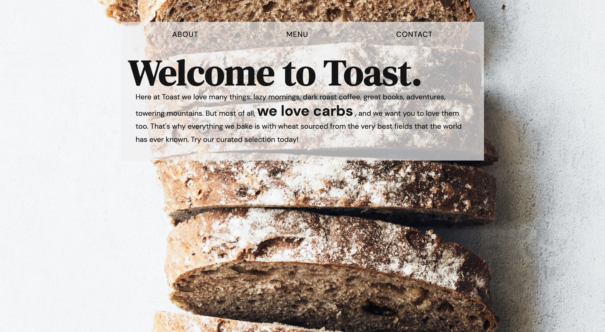
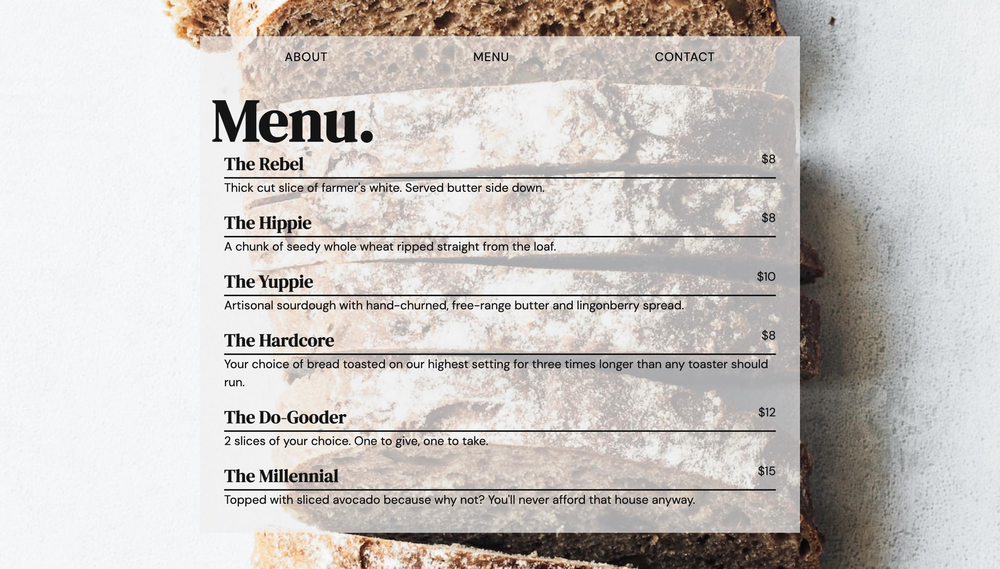
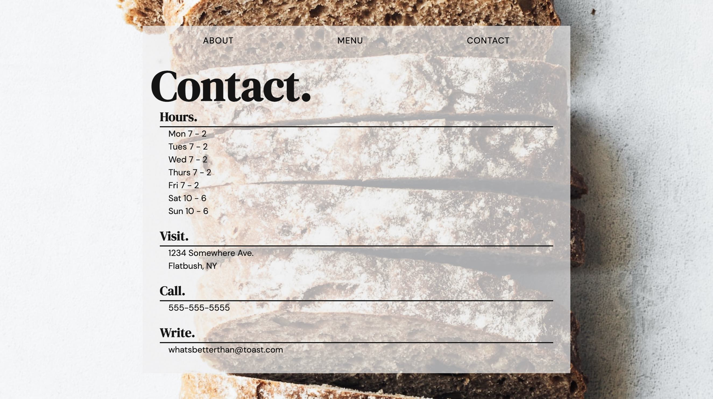

# Restaurant Page Project

This is an implementation of the [Odin Project's](https://www.theodinproject.com/) Restaurant Page project. 

It uses javascript to toggle between About, Menu, and Contact tabs. 

## Built with

- Webpack

### Screenshots

About: 

Menu:

Contact:

